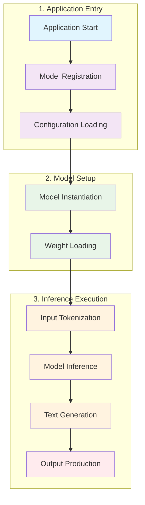

# NNTrainer CausalLM Inference Pipeline Flow Diagram



## Detailed Pipeline Flow

```
┌─────────────────────────────────────────────────────────────────────────────┐
│                            MAIN ENTRY POINT                                 │
│                              (main.cpp)                                     │
├─────────────────────────────────────────────────────────────────────────────┤
│                                                                             │
│  1. MODEL REGISTRATION FACTORY                                              │
│     ├── Register Qwen2ForCausalLM                                           │
│     ├── Register Qwen3ForCausalLM                                           │
│     ├── Register Qwen3MoeForCausalLM                                        │
│     ├── Register Gemma3ForCausalLM                                          │
│     ├── Register GptOssForCausalLM                                          │
│     └── ... (other model types)                                             │
│                                                                             │
│  2. CONFIGURATION LOADING                                                   │
│     ├── config.json          → Model architecture parameters                │
│     ├── generation_config.json → Text generation parameters                 │
│     └── nntr_config.json     → NNTrainer specific configuration             │
│                                                                             │
│  3. MODEL INSTANTIATION                                                     │
│     └── Factory::create() → Appropriate Model Constructor                   │
│                                                                             │
└─────────────────────────────────────────────────────────────────────────────┘
                                    │
                                    ▼
┌─────────────────────────────────────────────────────────────────────────────┐
│                          MODEL ARCHITECTURE                                 │
│                    (Applications/CausalLM/models/)                          │
├─────────────────────────────────────────────────────────────────────────────┤
│                                                                             │
│  BASE CLASSES HIERARCHY:                                                    │
│  ┌─────────────────────────────────────────────────────────────────────┐   │
│  │  Transformer (Base)                                                 │   │
│  │  └── Common transformer components                                  │   │
│  │      ├── Parameter setup                                            │   │
│  │      ├── Layer construction                                         │   │
│  │      └── Tokenizer integration                                      │   │
│  │                                                                     │   │
│  │  ┌── CausalLM (Inherits from Transformer)                           │   │
│  │  │   └── Causal language modeling functionality                     │   │
│  │  │       ├── Text generation                                        │   │
│  │  │       ├── KV cache management                                    │   │
│  │  │       └── Output formatting                                      │   │
│  │  │                                                                  │   │
│  │  └── Model-Specific Implementations (Qwen3, Gemma3, etc.)            │   │
│  │      └── Architecture-specific overrides                            │   │
│  └─────────────────────────────────────────────────────────────────────┘   │
│                                                                             │
└─────────────────────────────────────────────────────────────────────────────┘
                                    │
                                    ▼
┌─────────────────────────────────────────────────────────────────────────────┐
│                         INFERENCE PIPELINE                                  │
├─────────────────────────────────────────────────────────────────────────────┤
│                                                                             │
│  INPUT PROCESSING:                                                          │
│  ┌─────────────┐    Tokenizer     ┌─────────────┐                          │
│  │ Input Text  │ ───────────────→ │  Token IDs  │                          │
│  └─────────────┘                  └─────────────┘                          │
│        │                                 │                                 │
│        ▼                                 ▼                                 │
│  ┌─────────────┐                  ┌─────────────┐                          │
│  │ System      │                  │  Prompt     │                          │
│  │ Prompt      │                  │  Processing │                          │
│  └─────────────┘                  └─────────────┘                          │
│                                                                             │
│  MODEL EXECUTION:                                                           │
│  ┌─────────────────────────────────────────────────────────────────────┐   │
│  │                        FORWARD PASS                                 │   │
│  │  ┌─────────────┐                                                    │   │
│  │  │  Embedding  │                                                    │   │
│  │  ├─────────────┤                                                    │   │
│  │  │ Transformer │    ┌────────────────────────────────────────────┐  │   │
│  │  │ Decoder     │───▶│           N LAYERS                         │  │   │
│  │  │ Blocks      │    │  ┌─────────────┐  ┌─────────────┐         │  │   │
│  │  │ (Repeated)  │    │  │ Attention   │  │    MLP      │         │  │   │
│  │  │             │    │  └─────────────┘  └─────────────┘         │  │   │
│  │  │             │    │         │               │                 │  │   │
│  │  │             │    │         └───────┬───────┘                 │  │   │
│  │  │             │    │                 ▼                         │  │   │
│  │  │             │    │         ┌─────────────┐                   │  │   │
│  │  │             │    │         │  Add & Norm │                   │  │   │
│  │  │             │    │         └─────────────┘                   │  │   │
│  │  │             │    └────────────────────────────────────────────┘  │   │
│  │  ├─────────────┤                                                    │   │
│  │  │  RMSNorm    │                                                    │   │
│  │  ├─────────────┤                                                    │   │
│  │  │  LM Head    │                                                    │   │
│  │  └─────────────┘                                                    │   │
│  └─────────────────────────────────────────────────────────────────────┘   │
│        │                                                                 │
│        ▼                                                                 │
│  ┌─────────────┐    Sampling    ┌─────────────┐    Tokenizer   ┌─────────┐│
│  │   Logits    │ ──────────────▶│  Next Token │ ──────────────▶│Output   ││
│  └─────────────┘                └─────────────┘                │Text     ││
│                                 ┌─────────────┐                └─────────┘│
│                                 │  Generate   │                           │
│                                 └─────────────┘                           │
│                                       │                                   │
│                                       ▼                                   │
│                              ┌─────────────────┐                          │
│                              │  Performance    │                          │
│                              │  Metrics        │                          │
│                              │  (Timing, etc.) │                          │
│                              └─────────────────┘                          │
│                                                                             │
└─────────────────────────────────────────────────────────────────────────────┘
                                    │
                                    ▼
┌─────────────────────────────────────────────────────────────────────────────┐
│                           OUTPUT DELIVERY                                   │
├─────────────────────────────────────────────────────────────────────────────┤
│                                                                             │
│  ┌─────────────────────────────────────────────────────────────────────┐   │
│  │  Generated Text Output                                              │   │
│  │  - Model response                                                   │   │
│  │  - Performance metrics                                              │   │
│  │  - Memory usage statistics                                          │   │
│  └─────────────────────────────────────────────────────────────────────┘   │
│                                                                             │
│  ┌─────────────────────────────────────────────────────────────────────┐   │
│  │  Optional: C API Interface                                          │   │
│  │  - libcausallm_api.so                                               │   │
│  │  - For integration with other applications                          │   │
│  └─────────────────────────────────────────────────────────────────────┘   │
│                                                                             │
└─────────────────────────────────────────────────────────────────────────────┘
```

## Component Relationships

```
┌─────────────────────────────────────────────────────────────────────────────┐
│                                                                             │
│  [main.cpp] ───creates───▶ [Factory] ───creates───▶ [Model Instance]        │
│        │                        │                        │                 │
│        │                        │                        ▼                 │
│        │                        │              [Transformer Base]          │
│        │                        │                 ▲        ▲               │
│        │                        │                 │        │               │
│        │                        │      [CausalLM] │        │ [Qwen3,etc.]  │
│        │                        │                 │        │               │
│        │                        │                 └──[causal_lm.h]──┘      │
│        │                        │                          │               │
│        │                        │                          ▼               │
│        │                        │              [transformer.h]             │
│        │                        │                          │               │
│        ▼                        ▼                          ▼               │
│  [Configuration]        [Model Registry]        [Core NNTrainer Engine]     │
│                                                                             │
└─────────────────────────────────────────────────────────────────────────────┘
```

## CausalLM and Transformer Class Relationship

The relationship between `CausalLM` and `Transformer` classes is a key architectural design in the NNTrainer CausalLM application:

### Inheritance Hierarchy
```
┌─────────────────────────────────────────────────────────────┐
│                    Transformer (Base Class)                 │
│                    (transformer.h/transformer.cpp)          │
│  ┌───────────────────────────────────────────────────────┐  │
│  │ Core Transformer Functionality:                       │  │
│  │ • Model parameter setup                               │  │
│  │ • Layer construction (embedding, attention, MLP)     │  │
│  │ • Model compilation & initialization                  │  │
│  │ • Weight loading/saving                               │  │
│  │ • Basic tokenizer integration                         │  │
│  │ • Custom layer registration                           │  │
│  └───────────────────────────────────────────────────────┘  │
└─────────────────────────────────────────────────────────────┘
                            ▲
                            │ (Inheritance)
                            │
┌─────────────────────────────────────────────────────────────┐
│                      CausalLM (Derived Class)               │
│                    (causal_lm.h/causal_lm.cpp)              │
│  ┌───────────────────────────────────────────────────────┐  │
│  │ Causal Language Modeling Extensions:                  │  │
│  │ • Text generation with sampling strategies            │  │
│  │ • KV cache management for efficient inference         │  │
│  │ • Output token registration and formatting            │  │
│  │ • End-of-sequence token handling                      │  │
│  │ • Performance metrics collection                      │  │
│  │ • Language Model Head layer integration               │  │
│  └───────────────────────────────────────────────────────┘  │
└─────────────────────────────────────────────────────────────┘
                            ▲
                            │ (Inheritance)
                            │
┌─────────────────────────────────────────────────────────────┐
│                 Model-Specific Classes                      │
│            (e.g., Qwen3CausalLM, Gemma3CausalLM)            │
│  ┌───────────────────────────────────────────────────────┐  │
│  │ Model-Specific Customizations:                        │  │
│  │ • Architecture-specific attention mechanisms          │  │
│  │ • Custom layer implementations                        │  │
│  │ • Model-specific parameter handling                   │  │
│  │ • Specialized tokenizer processing                    │  │
│  └───────────────────────────────────────────────────────┘  │
└─────────────────────────────────────────────────────────────┘
```

### Key Implementation Details

1. **Transformer Base Class** (`transformer.h/transformer.cpp`):
   - Provides the foundational structure for all transformer models
   - Handles common components like model parameter setup, layer construction, and weight loading
   - Implements the basic model construction pipeline:
     - Embedding layer creation
     - Transformer decoder blocks (N layers) with attention and MLP components
     - RMSNorm layer
   - Manages tokenizer integration and custom layer registration

2. **CausalLM Derived Class** (`causal_lm.h/causal_lm.cpp`):
   - Inherits from Transformer to extend functionality for causal language modeling
   - Adds text generation capabilities with sampling strategies (greedy, top-k, top-p)
   - Implements KV cache management for efficient inference
   - Handles output token registration and formatting
   - Adds Language Model Head layer on top of the transformer base
   - Manages performance metrics collection

3. **Model-Specific Classes** (e.g., `Qwen3CausalLM`):
   - Multiple inheritance from both CausalLM and model-specific transformer class
   - Override base methods for model-specific behaviors
   - Implement custom attention mechanisms and layer configurations

### Constructor Chain
```
Qwen3CausalLM::Qwen3CausalLM(json &cfg, json &generation_cfg, json &nntr_cfg) :
    Transformer(cfg, generation_cfg, nntr_cfg, ModelType::CAUSALLM),
    CausalLM(cfg, generation_cfg, nntr_cfg),
    Qwen3Transformer(cfg, generation_cfg, nntr_cfg) {}
```

This design allows for maximum code reuse while enabling model-specific customizations.

## Key Data Flow

```
Input Text
    ↓
[HuggingFace Tokenizer]
    ↓
Token IDs
    ↓
[Embedding Layer]
    ↓
Transformer Decoder Blocks (N times)
    ↓
[RMSNorm Layer]
    ↓
[Language Model Head]
    ↓
Logits
    ↓
[Sampling Strategy]
    ↓
Next Token ID
    ↓
[Tokenizer Decode]
    ↓
Output Text